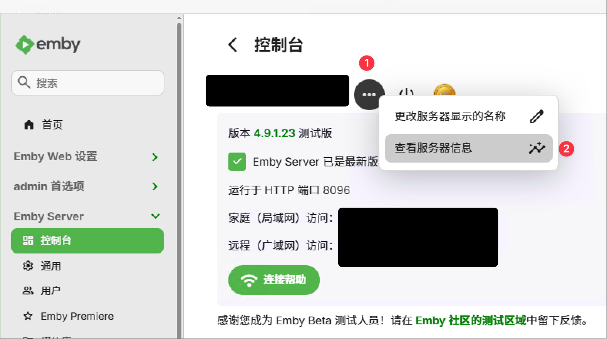
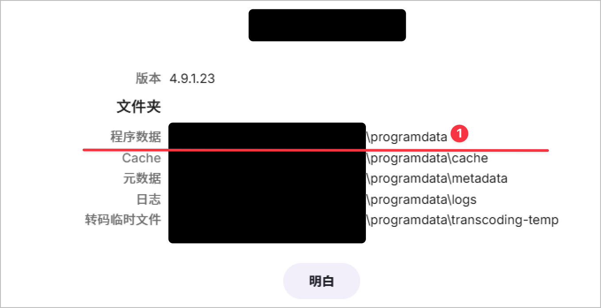
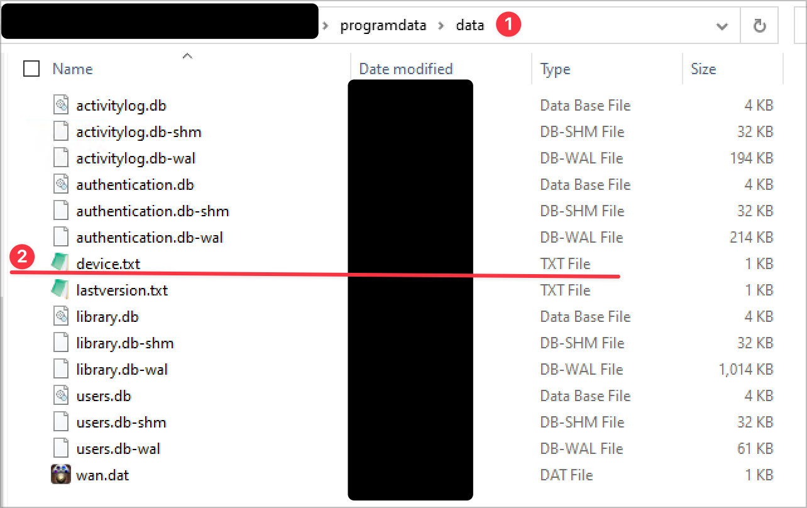

# LinuxServer IO - Emby HappyMod

This is only used for research and learning purposes. Please do not use this in production or sale it as your own work.

## Credits

- Original work by: https://github.com/2017fighting/docker-mods/blob/emby-crack/Program.cs licensed under GPL v3.
- Thanks to LinuxServer.io for Docker Mod mechanism and their template under: https://github.com/linuxserver/docker-mods
- Partial documentation is generated by Github Copilot.

## License 

GNU AGPL v3

## Usage

**Please strictly follow the instructions below**:

1. You must use base image from [LinuxServer.io Emby](https://hub.docker.com/r/lscr.io/linuxserver/emby)
2. Host your own license server via Cloudflare Worker [here](#host-license-server-yourself-via-cloudflare-worker)
3. Change `DOCKER_MODS` and add `EMBY_CRACK_URL` environment variable correspondingly and start the emby server
```diff
services:
  emby:
    image: lscr.io/linuxserver/emby:latest
    environment:
-      DOCKER_MODS: other-docker-mod
+      DOCKER_MODS: other-docker-mod|ghcr.io/username/emby-happymod:version
+      EMBY_CRACK_URL: https://embycrack.sample.com   # replace with your own URL
```

After deployment your own emby server:

- Follow the screenshot below to identify your server ID: (usually it's located in `/config/data/device.txt` ):
  






Taken Emby Premiere as an example and `226b2cf575faa73e64c29d37cac59427` as example server ID:

- Open your browser and access: `https://your-worker/licgen?deviceId=226b2cf575faa73e64c29d37cac59427` to get your license key, if there's an independent feature that you'd like to enable, you can also specify `featId` parameter, e.g. `&featId=someAwesomeFeature`. You should NOT specify `featId` unless you know what you're doing.
- Insert it to your emby server admin console
- Restart your emby server. You may found license file under: `/config/config/mb.lic` .
- Enjoy Emby Premiere features for free!

## Host License Server Yourself via Cloudflare Worker

- Install NodeJS latest/LTS version and Wrangler CLI following [Cloudflare official document](https://developers.cloudflare.com/workers/get-started/guide/)
- (Recommend but optional) Install PNPM to save your disk following [PNPM official document](https://pnpm.io/installation)
- Clone this repo and go to `worker-srv` folder
- Execute `pnpm run deploy` or `npm run deploy` to deploy the worker to your Cloudflare account

## FAQ

Referrence for S6 Service Lifecycle in LSIO docker image:
- https://github.com/linuxserver/docker-emby
- https://github.com/just-containers/s6-overlay
- https://github.com/linuxserver/docker-baseimage-ubuntu

Emby Official Guide:
- https://emby.media/support/articles/Server-Data-Folder.html

For Cloudflare Worker Troubleshooting:
- Change `worker-srv/wrangler.jsonc` to `"vars": {"CUR_ENV": "troubleshoot", ...}` to enable detailed request log, default value is `production`
- Check your worker log in Cloudflare Dashboard -> Workers -> Your Worker -> Logs

## Further Reading

- https://blog.jiawei.xin/?p=469
- https://crackemby.mb6.top (You may not directly use this service due to different url rewritten policy, especially for amending ".php" extension)

------

# Original Project README

## Emby Crack - Docker mod for Emby

> Get Emby Premiere For Free，Method Referrence from [here](https://yubanmei.com/archives/133.html)

## Usage
1. You must use base image from [LinuxServer.io Emby](https://hub.docker.com/r/lscr.io/linuxserver/emby)
2. Host your own authorization server [here](#host-authorization-server-yourself)
3. Change `DOCKER_MODS` and add `EMBY_CRACK_URL` environment variable correspondingly
```diff
services:
  emby:
    image: lscr.io/linuxserver/emby:latest
    environment:
-      DOCKER_MODS: other-docker-mod
+      DOCKER_MODS: other-docker-mod|ghcr.io/username/emby-happymod:version
+      EMBY_CRACK_URL: https://embycrack.sample.com   # replace with your own URL
```

## Host Authorization Server Yourself

Sample of building with [caddyServer](https://caddyserver.com/)

```Caddyfile
(cors) {
        @cors_preflight{args[0]} method OPTIONS
        @cors{args[0]} header Origin {args[0]}
        handle @cors_preflight{args[0]} {
                header {
                        Access-Control-Allow-Origin {args[0]}
                        Access-Control-Allow-Methods "GET, POST, PUT, PATCH, DELETE, OPTIONS"
                        Access-Control-Allow-Headers *
                        Access-Control-Max-Age 3600
                        defer
                }
                respond 204
        }
        handle @cors{args[0]} {
                header {
                        Access-Control-Allow-Origin {args[0]}
                        Access-Control-Expose-Headers *
                        defer
                }
        }
}

(cors_any) {
        @cors_preflight method OPTIONS

        header {
                Access-Control-Allow-Origin "{header.origin}"
                Vary Origin
                Access-Control-Expose-Headers "Authorization"
                Access-Control-Allow-Credentials "true"
        }

        handle @cors_preflight {
                header {
                        Access-Control-Allow-Methods "GET, POST, PUT, PATCH, DELETE"
                        Access-Control-Max-Age "3600"
                }
                respond "" 204
        }
}

# replace with your own domain
embycrack.sample.com {
    # CORS settings, choose either cors or cors_any
    import cors_any
    #import cors "https://emby.sample.com" 

    respond /admin/service/registration/validateDevice `{"cacheExpirationDays":3650,"message":"Device Valid","resultCode":"GOOD"}`

    respond /admin/service/registration/validate `{"featId":"MBSupporter","registered":true,"expDate":"2099-01-01","key":"114514"}`

    respond /admin/service/registration/getStatus `{"deviceStatus":"","planType":"Lifetime","subscriptions":{}}`

    respond /admin/service/appstore/register `{"featId":"","registered":true,"expDate":"2099-01-01","key":""}`

    respond /emby/Plugins/SecurityInfo `{"SupporterKey":"","IsMBSupporter":true}`
}
```
